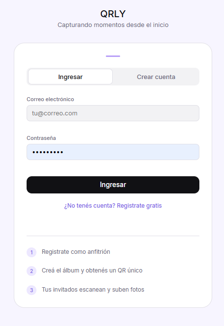
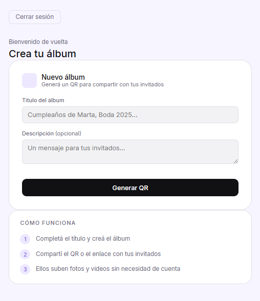
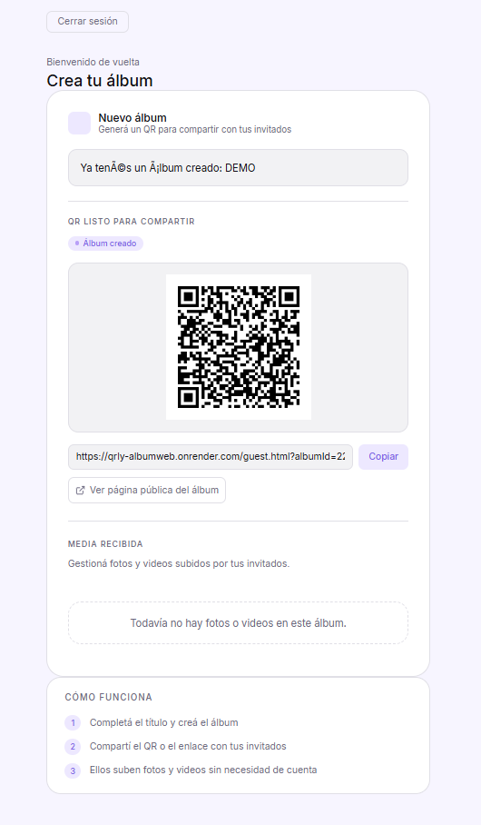
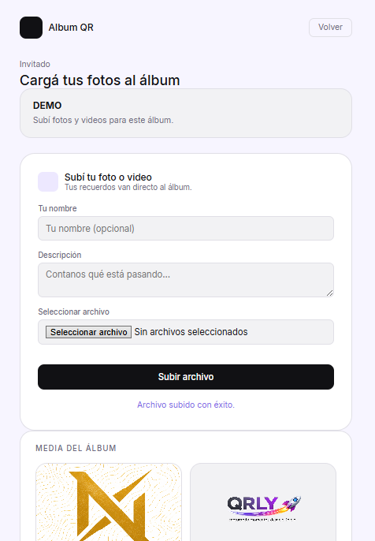

<p align="center">
  
</p>

<h1 align="center">QRLY</h1>

<p align="center">
  Shared QR-based media albums for events and celebrations.
</p>

<p align="center">
  Create a private album, generate a QR code and allow guests to upload photos and videos instantly without needing an account.
</p>

---

# 📸 About The Project

QRLY is a full-stack web application designed to simplify media sharing during events, parties, birthdays, meetings and celebrations.

Instead of asking every guest individually for photos and videos after an event, QRLY centralizes everything into one shared digital album using QR-based access.

The host creates an album, generates a unique QR code and guests can instantly upload media directly from their phones without registration.

---

# 🚀 Features

- 🔐 Host authentication system
- 📁 Album creation and management
- 📷 QR-based album sharing
- 👥 Guest uploads without account creation
- ☁️ Cloud media storage with Cloudinary
- 🗄️ Supabase database integration
- 🎥 Support for images and videos
- 📱 Mobile-friendly upload flow

---

# 🖼️ Application Flow

## 1. Authentication

Hosts can create an account and log into their dashboard.

<p align="center">
  
</p>

---

## 2. Album Creation

The host creates a new album and configures basic information for guests.

<p align="center">
  
</p>

---

## 3. QR Generation & Sharing

QRLY generates a unique QR code and public link to share with guests.

<p align="center">
  
</p>

---

## 4. Guest Upload Page

Guests can upload photos and videos directly into the album without needing an account.

<p align="center">
  
</p>

---

# 🏗️ Architecture

```txt
Frontend (HTML/CSS/JavaScript)
        ↓
Express.js Backend API
        ↓
Supabase Auth + Database
        ↓
Cloudinary Media Storage
```

---

# 🛠️ Tech Stack

## Backend

- Node.js
- Express.js
- Supabase
- Cloudinary
- Multer
- QRCode
- dotenv

## Frontend

- HTML
- CSS
- Vanilla JavaScript

---

# 🔑 Core Functionalities

## Authentication

- Host registration
- Secure login system
- JWT-based session handling

## Album System

- One album per host
- Public QR-based access
- Album ownership validation

## Media Uploads

- Image/video upload handling
- Cloudinary integration
- Metadata storage in Supabase

---

# 📡 API Routes

## Authentication

```http
POST /auth/register
POST /auth/login
```

## Albums

```http
GET /album/host
POST /album
GET /album/:albumId/qr
```

## Media

```http
GET /media/album/:albumId
POST /media/upload
```

---

# ⚙️ Installation

## Clone repository

```bash
git clone https://github.com/nicolaspereirasilvera23-source/AlbumQR-WEb.git
```

---

## Install dependencies

```bash
npm install
```

---

## Create `.env` file

```env
PORT=3000

SUPABASE_URL=
SUPABASE_KEY=
SUPABASE_SERVICE_ROLE_KEY=

CLOUDINARY_CLOUD_NAME=
CLOUDINARY_API_KEY=
CLOUDINARY_API_SECRET=

JWT_SECRET=
HOST_URL=
```

---

## Start development server

```bash
npm start
```

---

## Open application

```txt
http://localhost:3000/index.html
```

---

# 🧪 Demo Flow

1. Register a host account
2. Log into the dashboard
3. Create a shared album
4. Generate a QR code
5. Share the QR/link with guests
6. Upload photos/videos as guests
7. View uploaded media in the album

---

# ⚠️ Technical Challenges

- Managing public uploads securely without guest accounts
- Linking uploaded media to the correct album
- QR-based public access flow
- Handling image/video validation and uploads
- Synchronizing cloud media storage with database records

---

# 🔮 Future Improvements

- Real-time gallery updates
- AI-based media categorization
- Guest nicknames and reactions
- Album moderation tools
- Downloadable album packages
- Temporary QR links
- Multiple albums per host
- Improved responsive design
- Modernized UI with Bootstrap/Tailwind

---

# 📌 Project Status

QRLY is currently a functional MVP focused on collaborative QR-based media sharing.

Current version supports:

- Authentication
- Album creation
- QR generation
- Guest uploads
- Cloud media storage
- Shared galleries

---

# 🔒 Security Notes

- Never upload `.env` files to the repository
- Protect API keys and secrets
- Validate uploaded file types and sizes
- Use strong JWT secrets in production

---

# 👨‍💻 Author

Nicolás Pereira Silvera

GitHub:
https://github.com/nicolaspereirasilvera23-source

LinkedIn:
https://www.linkedin.com/in/nicolas-psilvera
